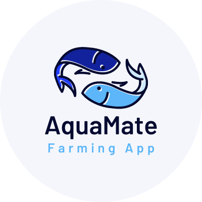

# AquaMate: Freshwater Fish Disease Classification



Welcome to AquaMate, an application designed to classify freshwater fish diseases using advanced deep learning techniques. This repository contains the complete codebase for the AquaMate application, leveraging Convolutional Neural Networks (CNN) to accurately identify various fish diseases. The dataset used is sourced from Kaggle's "Freshwater Fish Disease Aquaculture in South Asia."

## Overview

AquaMate aims to assist aquaculture practitioners in identifying diseases in freshwater fish, enabling timely and effective intervention. The application classifies images into one of seven categories:

1. Bacterial Red Disease
2. Bacterial Diseases - Aeromoniasis
3. Bacterial Gill Disease
4. Fungal Diseases Saprolegniasis
5. Healthy Fish
6. Parasitic Diseases
7. Viral Diseases White Tail Disease

## Features

- **Automated Disease Detection**: Upload an image of a fish, and AquaMate will classify the disease.
- **Accurate Classification**: Utilizes both transfer learning with EfficientNetB1 and a custom CNN model to ensure high accuracy.
- **User-Friendly Interface**: Intuitive interface for ease of use by aquaculture practitioners.

## Dataset

The dataset comprises images categorized into the aforementioned classes. It is essential to preprocess the data correctly for training the models.

### Data Preparation

- The dataset is downloaded from Kaggle and extracted into the required directory structure.
- Images are split into training and validation sets with an 80-20 ratio.
- Data augmentation and preprocessing are performed using `ImageDataGenerator`.

## Model Architecture

AquaMate uses two models:

1. **Transfer Learning with EfficientNetB1**:
    - Pretrained on ImageNet.
    - Additional dense and dropout layers for fine-tuning.

2. **Custom CNN Model**:
    - Multiple Conv2D and MaxPooling2D layers.
    - Flattening followed by dense layers for classification.

### Custom CNN Model Layers:

```plaintext
Layer (type)                     Output Shape          Param #
=================================================================
conv2d (Conv2D)                  (None, 148, 148, 32)  896
max_pooling2d (MaxPooling2D)     (None, 74, 74, 32)   0
conv2d_1 (Conv2D)                (None, 72, 72, 64)   18496
max_pooling2d_1 (MaxPooling2D)   (None, 36, 36, 64)   0
flatten (Flatten)                (None, 82944)        0
dense (Dense)                    (None, 128)          10616960
dense_1 (Dense)                  (None, 7)            903
=================================================================
Total params: 10,635,255
Trainable params: 10,635,255
Non-trainable params: 0
```

### Model Compilation and Training

- Compiled with `categorical_crossentropy` loss and `adam` optimizer.
- Training for 10 epochs with early stopping and learning rate reduction callbacks.

### Evaluation and Results

- Evaluated on the validation dataset.
- Metrics plotted for accuracy and loss.

## Application Workflow

1. **Data Download and Extraction**:
    ```bash
    kaggle datasets download -d subirbiswas19/freshwater-fish-disease-aquaculture-in-south-asia
    unzip freshwater-fish-disease-aquaculture-in-south-asia.zip -d /content/data/
    ```

2. **Model Training**:
    ```bash
    python train_model.py
    ```

3. **Model Saving**:
    - Architecture saved in JSON format.
    - Weights saved as binary files.
    - All model files compressed into a ZIP file.

4. **Application Deployment**:
    - Use the trained model in a web or mobile application to classify fish diseases from uploaded images.

## Getting Started

### Prerequisites

Ensure you have the necessary libraries installed:

```bash
pip install tensorflow kaggle matplotlib
```

### Running on Google Colab

To run the project on Google Colab, follow these steps:

1. **Set Up Kaggle API**:
    - Upload your `kaggle.json` file to the Colab environment.
    - Execute the following commands to set up Kaggle and download the dataset:
    ```python
    from google.colab import drive
    drive.mount('/content/drive')

    !pip install -q kaggle
    !mkdir ~/.kaggle
    !cp /content/drive/MyDrive/kaggle.json ~/.kaggle/
    !chmod 600 ~/.kaggle/kaggle.json
    !kaggle datasets download -d subirbiswas19/freshwater-fish-disease-aquaculture-in-south-asia
    !unzip freshwater-fish-disease-aquaculture-in-south-asia.zip -d /content/data/
    ```

2. **Open the Notebook**:
    - Open `Aquamate_EfficientNetB1.ipynb` in Google Colab.

3. **Run the Notebook**:
    - Execute each cell in the notebook sequentially. This will preprocess the data, train the model, and save the results.

### Running the Training Script

Alternatively, you can run the training script directly if you have set up your local environment:

```python
python train_model.py
```

## Conclusion

AquaMate leverages state-of-the-art deep learning techniques to provide an effective solution for freshwater fish disease classification. Contributions and suggestions for improvements are welcome.
